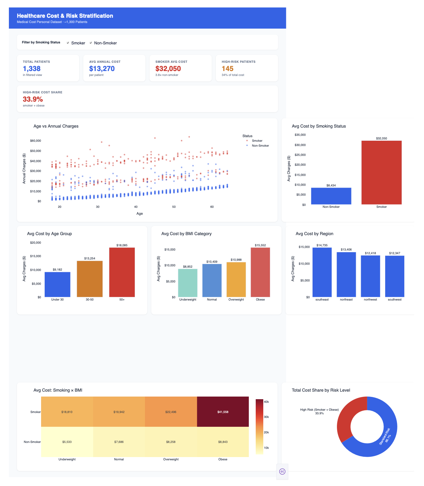

# Healthcare Cost & Risk Stratification Analytics
A data analytics project analyzing healthcare cost drivers and patient risk factors, built with **SQL**, **Python**, and an interactive **Plotly Dash** dashboard.

---

## Dashboard Preview


---

## Business Problem
Healthcare organizations need to understand which patient groups contribute most to overall costs in order to design targeted interventions, improve outcomes, and optimize resource allocation. This project identifies high-cost populations and uncovers patterns that can support data-driven decision-making.

---

## Dataset
- **Source:** Medical Cost Personal Dataset ([Kaggle](https://www.kaggle.com/datasets/mirichoi0218/insurance))
- **Size:** ~1,300 patient records
- **Features:** Age, Sex, BMI, Smoking status, Dependents, Region, Healthcare charges

---

## Tools & Technologies
| Tool | Purpose |
|---|---|
| **SQL (SQLite)** | Data querying, aggregation, segmentation |
| **Python / pandas** | Data preparation, feature engineering |
| **matplotlib / seaborn** | Static EDA charts |
| **Plotly Dash** | Interactive dashboard (Tableau equivalent) |

---

## Project Structure
```
healthcare-analytics/
├── data/
│   └── insurance.csv          ← download from Kaggle
├── sql/
│   └── analysis_queries.sql   ← 12 analytical SQL queries
├── python/
│   ├── 01_data_prep.py        ← cleaning, feature engineering, SQLite load
│   ├── 02_eda_visualizations.py   ← 8 static charts → outputs/figures/
│   ├── 03_risk_segmentation.py    ← cost tiers, cohort analysis, CSV export
│   └── 04_dashboard.py        ← interactive Dash dashboard
└── outputs/
    ├── figures/               ← saved chart PNGs
    └── patients_enriched.csv  ← enriched dataset export
```

---

## Setup & How to Run

**1. Install dependencies**
```bash
pip install pandas matplotlib seaborn plotly dash
```

**2. Download dataset**
- Go to [Kaggle Insurance Dataset](https://www.kaggle.com/datasets/mirichoi0218/insurance)
- Save `insurance.csv` to the `data/` folder

**3. Run in order**
```bash
# Step 1 — Prepare data and load SQLite DB
python python/01_data_prep.py
# Step 2 — Generate static EDA charts
python python/02_eda_visualizations.py
# Step 3 — Run risk segmentation analysis
python python/03_risk_segmentation.py
# Step 4 — Launch interactive dashboard
python python/04_dashboard.py
# → Open the local address in your browser
```

**4. Run SQL analysis** (optional)
- Open `sql/analysis_queries.sql` in VS Code with the SQLite extension
- Or use: `sqlite3 data/healthcare.db < sql/analysis_queries.sql`

---

## Key Insights
- **Smoking is the #1 cost driver** : smokers incur ~3.8× higher annual costs than non-smokers
- **Obesity amplifies cost when combined with smoking** : the high-risk cohort (smoker + obese) represents ~11% of patients but drives ~34% of total costs
- **Patients aged 50+** represent the highest average cost group, significantly above the population mean
- **A small high-risk subset** contributes disproportionately to total healthcare spending : a key target for preventive intervention

---

## Dashboard Features
The interactive Plotly Dash dashboard provides:
- **KPI cards** : Total patients, avg cost, smoker multiplier, high-risk share
- **Scatter plot** : Age vs charges colored by smoking status
- **Bar charts** : Cost by smoking status, age group, BMI category, region
- **Heatmap** : Combined risk matrix (smoking × BMI)
- **Donut chart** : High-risk vs standard-risk cost share
- **Live filter** : Toggle smoking status to explore subgroups interactively

---

## Future Work
- Incorporate time-series healthcare data to identify cost trends over time
- Build predictive models (logistic regression, random forest) for cost forecasting
- Extend analysis to real-world claims datasets (e.g., CMS Medicare data)
- Add geospatial analysis for regional health disparities
